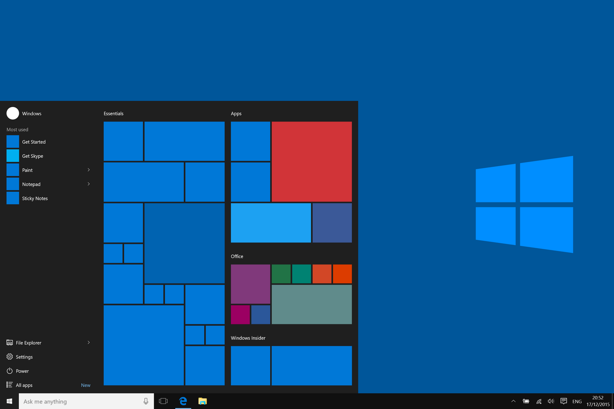
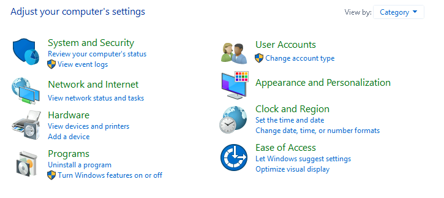

# Task 1 Introduction to Windows

This is a basic introduction to the Windows OS. The main objective is to start the Virtual Machine.
We have two options:
- Start Machine in the web browser.
- Open Virtual Machine via Remote Desktop and log in with the provided credentials.

I picked the first option and logged in through the web browser.

# Task 2 Windows Editions

## What is an OS?

An Operating System is the main software that manages all hardware and software on a computer. It acts as a bridge between the machine and the user, allowing programs to run and devices to communicate.

Windows has a long history, dating back to 1985, and is still the dominant operating system in both home and corporate networks. Due to its popularity, Windows OS has always been a target for threat actors.

The authors in this section take us through the history of Windows, up to the latest version, Windows 11.

Windows 10 comes in two versions: Home and Pro. These two versions are different from each other.

The current Windows operating system for servers is Windows Server 2019, and for the attached virtual machine, we also use Windows Server 2019 Standard.

Objective of this task is to answer the question:

**What encryption can you enable on Pro that you can't enable in Home?**

The correct answer is BitLocker.

## What is BitLocker?

BitLocker protects your computer from unauthorized access by encrypting the entire drive. It's the default Windows encryption system and encrypts the C: drive to keep your data safe.

# Task 3 The Desktop (GUI)

## What is GUI?

A Graphical User Interface (GUI) lets users interact with devices through icons and visual elements, instead of typing commands. GUIs were developed to be more user-friendly than Command-Line Interfaces. (CLIs)

<small>Image Source: Wikipedia</small>

## What is CLI?

A Command-Line Interface is a way of interacting with a computer by typing text commands into a terminal or console.

<small>Image Source: Wikipedia</small>

--- 

In short:
- GUI = Click buttons
- CLI = Type commands

CLIs are powerful and efficient for advanced users, but they are hard to learn for beginners. This was the reason why GUIs were created!

In this section, the authors provide basic information about the Windows GUI, but I decided not to include that in my notes since I've been a Windows user since I was a kid, I didn't feel the need to include it in my notes.

---

Objective of this task is to answer 3 questions:

**Which selection will hide/disable the Search box?**

Answer: Hidden

**Which selection will hide/disable the Task View button?**

Answer: Show Task View button

**Besides Clock and Network, what other icon is visible in the Notification Area?**

Answer: Action Center

# Task 4 The File System

## What is a File System?

A file system organizes and stores data on a storage device. Without a file system, data would be scattered randomly, and the computer wouldn’t know how to access it. It ensures data is ordered and accessible.

## What is FAT?

The File Allocation Table (FAT) is a simple file system that uses a table at the top of the volume to keep track of file locations.

## FAT characteristics:

- Two copies of FAT for protection.
- Used in USB drives, SD cards, external drives, and consoles etc.

## Limitations:

- Maximum size: 2TB partition, 4GB file.
- Poor performance with large volumes.
- No file permissions.
- Inefficient space use.

## What is exFAT?

exFAT is an improved version of FAT32 with no practical size limits on files or partitions.

## Limitations:

- Less compatibility than FAT32 (some older devices and Linux versions may not support it).

## What is NTFS?

NTFS (New Technology File System) is the primary file system for modern Windows systems. It is a journaling file system, meaning it can repair itself using log files after a failure.

## NTFS improvements:

- Limitless file/partition size.
- File/folder permissions.
- File compression.
- Encryption (Encryption File System or EFS).

You can check your system’s file system by looking at the Properties of your hard drive.

## File and Folder Permissions

Permissions allow you to grant or deny access to files and folders. The image below shows how these permissions work:

<small>Image Source: Microsoft</small>

## Alternate Data Streams (ADS)

ADS is a function of NFTS, which allows to hide data in "second stream" ("") of the file. Every file has at least one data stream and ADS allows files to contain more than one stream of data.

For example Windows Explorer doesn't display ADS to the users. There are 3rd party exectuables that can be used to see the data or you can use Powershell that gives you ability to view ADS for files ($DATA)

$DATA is a type of data stream.

These data streams have bad reputation since they have been used and abused by malware writers to write hidden data varying from data about where a file came from to complete malware files.

## In short:

ADS is a feature of NTFS that allows files to have more than one data stream. While Windows Explorer doesn’t show ADS, tools like PowerShell can display it.

# Task 5 The Windows\System32 Folders 

`C:\Windows` is known as the main folder which contains the Windows opearting system.
It doesn't necessarily have to be located on the C: drive. It can reside in any other drive and folder.

In windows, 
%windir%
 is an environment variable in Windows that points to the folder where the Windows OS is installed. 

 ## Windows32

The System32 folder holds the most important files that are critical for the operating system! 

Many of the files in System32 are required to run Windows. If this folder is deleted or damaged it can cause the entire system to crash or become unstable, you should proceed with extreme caution when interacting with this folder.

Objective for this task was to answer the question:

**What is the system variable for the Windows folder?**

%windir%

# Task 6 User Accounts, Profiles, and Permissions

User accounts on typical local Windows can be one of two types: Administrator and Standard User.

The user account type determines what action a user can perform on that specific Windows system.

An Administrator can make changes to the system like:
- Add users
- Delete users
- Modify groups
- Modify settings on the system

A Standard User can only make changes to folders/files attributed to this specific user and can't perform system-level changes, e.g., install programs.

There are several ways to determine which user accounts exist on the system.

One way is to click the `Start Menu` and type `Other User`. A shortcut to `Other users` should appear.

If you're logged in as Administrator, you see an option to `Add someone else to this PC`, in other words, you can create a new user account for this specific Windows. A Standard User will not see this option.

If there is a created Standard User account and you click on it, more options should appear like: `Change account type` and `Remove`.

You can change user permissions to Administrator or keep permissions as Standard User. When a user account is created, a profile is created for the user.

The location for each user profile will be stored in `C:\Users`

Another way to access this information is using `Local User and Group Management`

Right-click on the `Start Menu` and click `Run`. Type `lusrmgr.msc`

The Run Dialog Box allows you to open items quickly, it's a really handy tool. 

When you enter lusrmgr you can see two folders: `Users` and `Groups`

When you click on `Groups`, you can find all the names of the local groups along with a brief description for each. Each group has permissions set to it, and users are assigned to groups by the Administrator. When a user is assigned to a group, the user **inherits the permissions** of that group.

A user can be assigned to multiple groups.

You can also create, delete and modify user permissions. You can even set a few password settings like:
- Upon next login User has to change password to a new one
- This user can never change the password
- Password never expires

You can disable or block the account too.

# Task 7 User Account Control

The large majority of the home users are logged into their Windows as local administrators. It means that they can make changes to their system.

A user doesn’t need admin privileges to do everyday tasks like browsing the internet or working on documents. Having admin privileges increases the risk of  malware infection because it would run with the same access level as the user, making it easier for the malware to make changes to the system.

To protect the local user with such privileges, Microsoft intorudced User Account Control. (UAC)

## What is UAC?

User Account Control it's a security feature in Windows that helps prevent unauthorized changes to your system. When enabled, it prompts your for permission(or an administrator password) whenever a program tries to make changes that require higher privileges, like installing software of changing system settings.

The goal of UAC is to help protect your PC from malware and accidental changes by limiting the number of tasks that can be done with admin privileges without your knowledge or approval.

## How does UAC work?

When a user with administrator privileges logs into a system, the current session doesn't run with elevated permissions. When an operating requiring higher-level privileges needs to execute, the user will be prompted to confirm if they permit the operation to run. 

This feature reduces the likelihood of malware successfully compromising your system.

Objective of this Task was to answer the question:

**What does UAC mean?**

Answer: User Account Control

# Task 8 Settings and the Control Panel

The primary locations to make changes are the Settings menu and the Control Panel. For a long time, the Control Panel has been go-to location to make system changes, but then The Settings menu was introduced in Windows 8.

The Settings menu is now the primary location users go to when they want to change system settings. There are similarities and differences between the two menus.

## Control Panel

- Older, classic interface (not touch-friendly)
- Offers advanced, detailed system settings
- Used for legacy tools like Device Manager, System Properties, etc.
- Preferred by power users and administrators
- slowly being phased out

## Settings Menu

- Modern, clean interface (touch-friendly)
- Designed for everyday users
- Focuses on personalization, updates, accounts, privacy, etc.
- Integrated with Microsoft account and cloud services
- Acively developed and expanding

The Control Panel is the place where you will access more complex and perform more complex system actions. In some cases, you may start in Settings and end up in the Control Panel. 

If unclear which to open - use the `Start Menu` and search for it.

Objective of this Task was to answer the question:

**In the Control Panel, change the view to Small icons. What is the last setting in the Control Panel view?** 

Answer: Windows Defender Firewall

